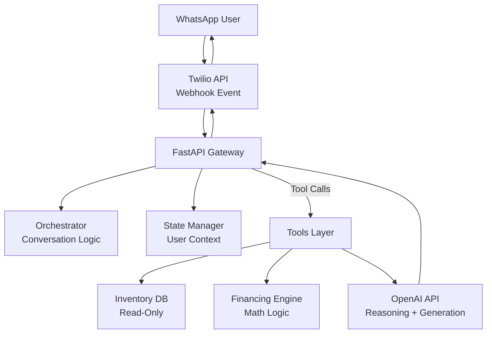

# kabak_openai_chat

**Python, development of a bot using LLMs (OpenAI API) to simulate the behavior of a Kavak sales agent.**

## 🚗 AI Automotive Agent – Demo & Architecture

This repository demonstrates a WhatsApp-based automotive sales assistant powered by **Twilio**, **FastAPI**, and **OpenAI**. It includes consultative guardrails, tool-based reasoning, financing calculations, and inventory search logic.

---

## 🧪 Test Scenarios to Try

Use these scenarios to validate that the consultative logic, search tools, and math offloading behave correctly.

### 1️⃣ Vague Request → Consultative Guardrail

* **User:**
  > “I need a car.”
* **Expected Agent Behavior:**
  Should ask clarifying questions (budget, type: SUV/Sedan) without triggering any search tool.

### 2️⃣ Normalization + Inventory Search

* **User:**
  > “Do you have any Chebys under 300k?”
* **Expected Agent Behavior:**
  1. Normalize “Chebys” → **Chevrolet**.
  2. Search inventory for Chevrolet with price < 300,000.
  3. Return *Onix* and *Aveo* from the data (`vehicles.cvs`).

### 3️⃣ Math Offloading (Financing)

* **User:**
  > “How much is the monthly payment for the Onix over 4 years?”
* **Expected Agent Behavior:**
  1. Compute 20% down payment.
  2. Call `calculate_financing` with correct loan amount and term.
  3. Present an exact monthly payment.

---

## 🏗 High-Level Architecture

The system follows a standard event-driven webhook pattern that moves user messages through **Twilio → FastAPI → OpenAI → Tools → Response**.

## 🧩 Agent Prompts & Logic

The agent's behavior is driven by a combination of explicit **System Instructions**, the **Conversation History**, and **Tool Definitions**.

### Agent Prompts

| Component | Role | Description |
| :--- | :--- | :--- |
| **System Prompt (Initial Instructions)** | `llm_promp.SYSTEM_INSTRUCTIONS` | Defines the agent's base personality, tone, style, constraints, and tool usage instructions. |
| **User Prompt (Incoming Message)** | Conversation History | Each incoming user message is appended to the history as a JSON object:   `{"role": "user", "content": "user_message"}` |
| **Tool Schema** | `tools_shema.TOOLS` | If defined, the agent can call these functions automatically or suggest them to the user. |
| **Tool Output** | Conversation History | If a tool is invoked, the agent receives and incorporates the output:   `{"role": "tool", "name": "function_name", "content": "function_response"}` |

# 🚀 Roadmap to Production

The transition to a production-ready system is planned in **three distinct phases**.

### Phase 1 — Infrastructure (The “How”)

This phase focuses on replacing temporary components with **scalable, robust infrastructure**.

  
- **Remove Global State**: The SESSIONS dictionary will reset if the server restarts. Replace it with Redis to store conversation history with a Time-To-Live (TTL) of 24 hours.

- **Async Processing**: OpenAI can be slow. Twilio times out after 15 seconds.
Solution: Make the webhook return 200 OK immediately, then process the AI logic in a background worker (Celery/BullMQ) and send the reply using twilio_client.messages.create().

- **Database Integration**:  Replace the mock MOCK_INVENTORY (csv file) with a read-replica connection to your actual SQL/NoSQL production database.

### Phase 2 — Evaluation (The “Quality”)

### Metrics:

- **Tool Accuracy**: Was `calculate_financing` called with the correct numbers extracted from user text?

- **Conversation Completion Rate**: Percentage of chats that reach a success state (e.g., “Schedule a Visit”).

- **Semantic Similarity Scoring**: Use Ragas or TruLens to compare model answers to Golden Answers.

### Phase 3 — Regression Testing

### How to Detect Prompt Regressions
- **Build a Golden Dataset**: (50 common user inputs).

- **In CI/CD**: test all 50 through the agent before deployment.

- **Use LLM-as-a-Judge**: Have a separate, strong model (like GPT-4o) grade the responses. If the "Pass Rate" drops below 95%, the deployment fails automatically.

